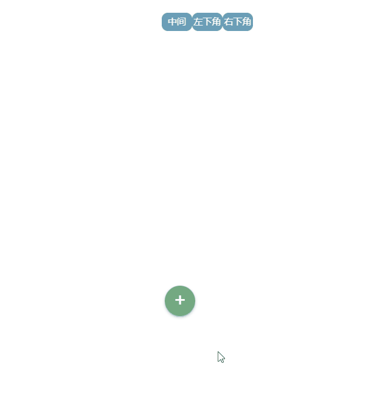
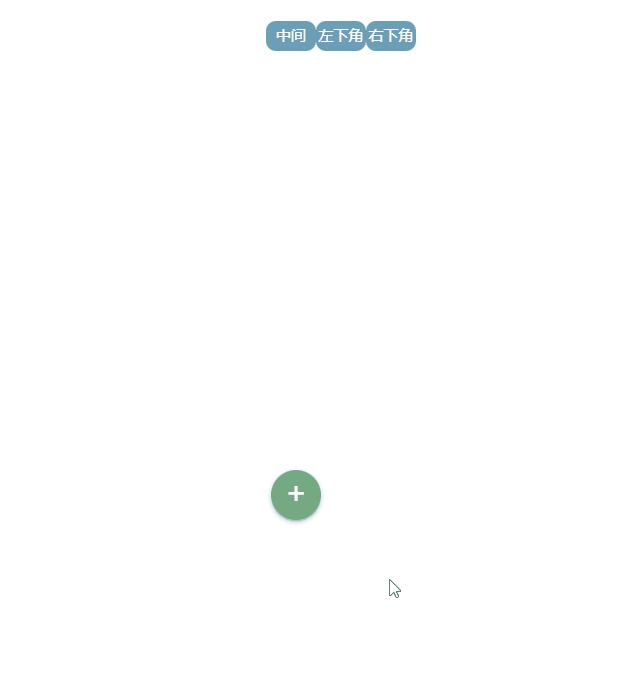
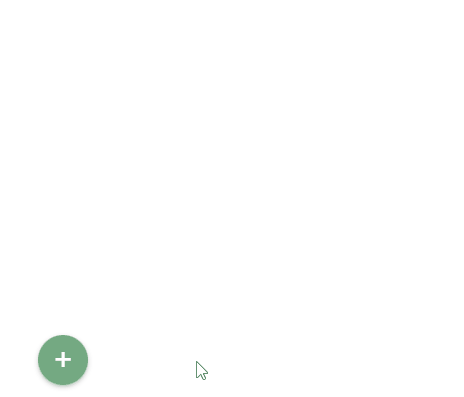
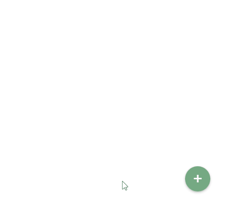
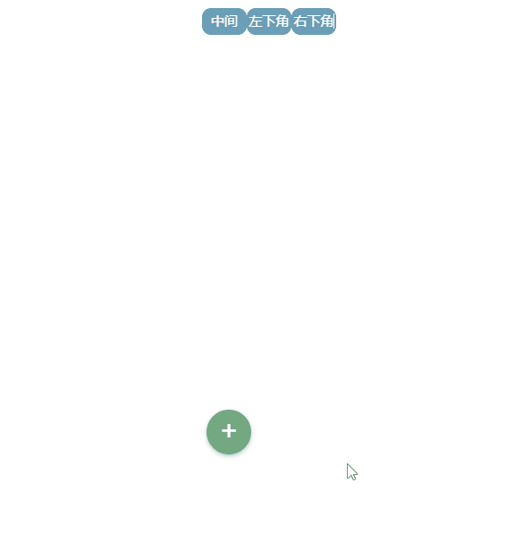

## 技术栈:vue+vue-router+vite

----

### 实例效果演示

1. 点击menu的button之后的效果


2. 点击空白处（menu之外）之后的效果



3. 点击item之后的效果



4.左下角



5.右下角



6.加上vue-router之后的menu(pending)

### get started
----
* 	git clone https://github.com/hupengda4473/discAS.git
*  npm install
*  npm run dev
*  之后访问浏览器的8080端口，可以看到项目跑起来了(now please check the port 8080 in your browser, you will see the menu in the page)

### usage
-----

##### 配置参数
	1. 	配置参数(默认有缺省值)
		*  radius：default为100px,item距离menu的button的距离
		*  startAngle:defaut为0,item开始的角度，以时钟3点钟方向记为0，然后顺时针方向为递增方向
		*  endAngle:default为315,最后一个item的角度
		*  itemNum:default为8,item(菜单选项)个数
		*  animationDuration:default为0.5s,每个item动画的执行时间
		*  itemAnimationDelay:default为0.04s,每个item之间animation触发的间隔延迟时间
		*  iconImgArr: 必选参数，该属性使用computed属性生成,是装icon的数组,方便使用自己的icon,元素为object，使用函数genarateIconObj生成

##### 模板部分
```html
<template>
  <div>
    <Bloom-menu
      :iconImgArr="iconImgArr"
      :radius="radius"
      :startAngle="startAngle"
      :endAngle="endAngle"
      :itemNum="itemNum"
      :animationDuration="animationDuration"
      :itemAnimationDelay="itemAnimationDelay"
      class="menu-center-wrapper"
    >
    </Bloom-menu>
  </div>

</template>
```
##### css部分
```css
@import 'common/stylus/menuConfig.styl'
```

##### js部分
	  import home from 'common/img/home.svg'
	  ....
        let iconImgArr = () => {
            let tmp = []
            tmp.push(getIconObj(house, 'house', '50'))
            ....
            return tmp
        }
       // 分别指定图标的url ,类名称， 以及background-size属性
         let getIconObj = (url, name, size = 50) => {
            let tmp = {}
            tmp.iconUrl = url
            tmp.iconName = name
            tmp.iconSize = size
            return tmp
         }


##### 跳过动画关闭菜单(选择item后button立即旋转归为)
###### menu.vue
         let animationCountIncrease = val => {
            //注释掉animationCountIncrease里所有代码
            //count.value++
            //if (count.value === total.value) {
              // isOpenChange()
               //count.value = 0
            //}
         }
         let showItemChange = index => {
            isOpenChange()//打开此方法注释
            showItem.value = false
            currentIndex.value = index
            emit('selectItem', index);
         }
  

##### 点击item碎片特效
###### item.vue
         .item-btn注释的样式打开即可

         /*&::before
        position absolute
        ...
        background-position 18% 40%, 20% 31%, 30% 30%, 40% 30%, 50% 30%, 57% 30%, 65% 30%, 80% 32%, 15% 60%,83% 60%, 18% 70%, 25% 70%, 41% 70%, 50% 70%, 64% 70%, 80% 71%*/
        

        建议将changeShowItem 里定时器改为200可以更好看到碎片效果
        let changeShowItem = () => {
            setTimeout(()=>{
                emit('showItemChange', props.index)
            },200);
        }

##### 温馨提示
        其中 跳过动画关闭菜单 和 点击item碎片特效 可一起开始使用，也可单独使用，具体使用可自行调试  




有问题请邮件联系我，email:295562365@qq.com


